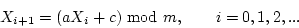

# CLASSICAL CRYPTOSYSTEM

## Shift Cipher OR CAESAR Cipher

Shift each letter to 3 places for encryption and shit back 3 for decryption. 

```
Enc: x -> x + k (mod 26)
Dec: x -> x - k (mod 26)

```

## Affin Cipher


##  Vigenere Cipher

- Better than the above two 
- Key for encryption is a vector (or an array) of letters (in 0-25 integer form) -  assume it as a word - rather than just one integer. 

```
H = 7
x = 21
c = x+k(mod 26) = 7+21 (mod 26) = 28 (mod 26) = 2

key =(21, 4, 2, 19, 14, 7)
PT:                     H   E   R   E   I   S   H   O   W   I   T   W   O   R   K   S
INDEX(x):               7   4   17  4   8   18  7   14  ....
KEY(k):                 21  4   2   19  14  7   21  4   ....
SHIFT(c = x+k(mod 26)): 2   8   19  23  22  ...
CT:                     C   I   T   X   W   ...
```


## Substitution Cipher

- Each letter in the alphabet is replaced by another letter. For instance, if the letter *a* is encrypted as letter *p*, then every time letter *a* appears in the plaintext, it’s replaced with letter *p* in the ciphertext.
- Ex. *Shit* and *Affin* but not Vigenere cipher. 
- Since Vigenere Cipher permutates block of letter rather one letter at a time. 
- The simplest of all substitution ciphers are those in which the cipher alphabet is merely a *cyclical* shift of the plaintext alphabet.
- Of these, the best-known is the *Caesar cipher*
- Unlike Caesar cipher where the alphabet is simply shifted, substitution cipher jumbles up the entire cipher alphabet.


## Block Cipher

- In shift, affin and subsitution cipher a given letter in cipher text always comes from exactly one letter in the plaintext.
- Vigenere is comparatively better and than those and made the ferequency analysis hard, but still possible.
- Block cipher, solves those problems, by encryting blocks of several letter or numbers simultaneously.


> In case of other cipehers, change in one char of p.t would only change a char of c.t but in BC even a change in one char of p.t block, should potentially change the correcponging all blocks and hence the all cipher text gets changed.

- Example of BC:
    - Playfair - the simplest BC.
    - DES - 64 bit BC
    - AES - 128 bit BC
    - RSA etc.

 - 2 modes to use BC: 
    - ECB
        - **Electronic code book** - converts blocks of p.t. to block of c.t independentally one at a time.
    - CBC
        - **Cipher block chaining** - use ciphertext of one block as feedback to other block.

## Playfair Cipher

- Simplest form of Block cipher. 
- Key is a word : 
    - Ex. `playfair` 
        - -> remove repetitive letter -> `playfir` 
        - -> make 5 x 5 matrix -> with `i` and `j` as same letter. 
    ```
        p   l   a   y   f   
        i   r   b   c   d   
        e   g   h   k   m
        n   o   q   s   t
        u   v   w   y   z
    ```
- Process for encryption :

    - Remove any punctuation or characters that are not present in the key square (this may mean spelling out numbers, punctuation etc.).
    - Identify any double letters in the plaintext and replace the second occurence with an 'x' e.g. 'hammer' -> 'hamxer'.
    - If the plaintext has an odd number of characters, append an 'x' to the end to make it even.
    - Break the plaintext into pairs of letters, e.g. 'hamxer' -> 'ha mx er'
    - Locate the letters in the key square,
        - If the letters are in different rows and columns, replace the pair with the letters on the same row respectively but at the other pair of corners of the rectangle defined by the original pair. The order is important – the first encrypted letter of the pair is the one that lies on the same row as the first plaintext letter. 
        - If the letters appear on the same row of the table, replace them with the letters to their immediate right respectively
        - If the letters appear on the same column of the table, replace them with the letters immediately below respectively
- ex.

```
Example 1 

PT      : M  E   E   T   A   T   T   H   E   S   C   H   O   O   L   H   O   U   S   E
Pair    : ME    ET  AT  TH  ES  CH  OO  LH  OU  SE
Insert x: ME    ET  AT  TH  ES  CH  OX  OL  HO  US  EX
Enc     : EG    MN  FQ  QM  ....  


PT      : M  E   E   T   A   T   T   H   E   S   C   H   O   O   L   H   O   U   S   E
PT      : M  E   X   T   A   T   X   H   E   S   C   H   O   X   L   H   O   U   S   E
Pair    : ME    XT  AT  XH  ES  CH  OX  LH  OU  SE
Enc     : EG    MN  FQ  QM  ....  

Example 2

Key : 

monarchy

m   o   n   a   r   
c   h   y   b   d
e   f   g   i   k   
l   p   q   s   t
u   v   w   x   z

Encryption : 

Pt:     we are discovered, save yourself
step1 : wearediscoveredsaveyourself
step2 : we  ar  ed  is  co  ve  re  ds  av  ey  ou  rs  el  fx
ct    : ug  rm  kc  sx  hm  uf  mk ...

```
## One Time Pad

- one-time pad (OTP) is an encryption technique that cannot be cracked,
- but requires the use of a one-time pre-shared key the same size as, or longer than, the message being sent.
- a plaintext is paired (XORed = bits added (mod 2)) with a random secret key.
- `Ci -> Xi XOR Ki` where Xi is p.t bits and Ki is key bits.
Ex:

```
    PT : 00101001
    Ke : 10101100
    CT : 10000101

```
**Advantage**:

- Major benifit over other is, it can be used to encrypt text as well a audio and video. 
- choosen plain text or choosen cipher text attack not possible.

**DisAdvantage**:
- KeySize
- True randomness of key is generally a real problem

## Some Other Topics

### Linear Feedback Shift Register (LFSR)

- 

### Seed & random number generator


- Seed is used as an input to `rand()`
- A random seed (or seed state, or just seed) is a number (or vector) used to initialize a pseudorandom number generator.
- it does not need to be random
- The random numbers which we call are actually “pseudo-random numbers”. These are generated by some kinds of deterministic algorithms.
- The seed during such random number generation is actually the starting point in the sequence. If we use same seed every time, it will yield same sequence of random numbers.
- The function `rand()` generates a pseudo random number each time it is called. By default it takes '1' as the seed value.

### Linear congruential generator (LCG)

- used in `rand()` function to generation randomness. However, using randomness from `rand()` is insecure.
- A linear congruential generator (LCG) is an algorithm that yields a sequence of pseudo-randomized numbers calculated with a discontinuous piecewise `linear equation`

     

 The sequence of number that it generates is X0,X1,X2,X3,….
 - The initial value X0 is called the seed;
 - a is called the constant multiplier;
 - c is the increment
 - m is the modulus

- More on [here](https://www.eg.bucknell.edu/~xmeng/Course/CS6337/Note/master/node40.html) and [here](https://en.wikipedia.org/wiki/Linear_congruential_generator)

### Multiplicative Inverse

- reciprocal
- what you multiply with a number to get 1?

```
8 * (1 / 8) = 1

so 1/8 is multiplicative inverse of 8
```
- Where its used in cryptography?

- Modular Multiplicative inverse.

```
Given two integers ‘a’ and ‘m’, find modular multiplicative inverse of ‘a’ under modulo ‘m’.
The modular multiplicative inverse is an integer ‘x’ such that.

a * x = 1 (mod m)

where, x should belong to {0,1,2,3 ... m-1}
```

- The multiplicative inverse of `a modulo m` exists if and only if `a` and `m` are relatively prime (i.e., if gcd(a, m) = 1).

```
Input:  a = 3, m = 11
find x?

 => 3 * x = 1 (mod 11) = 12 = 23 = 34 = 45 etc.
 => 3 * x = 12
 => x = 4

let's see with 45

 => 3 * x = 45
 => x = 15 but 15 != {0,1,2 .... 10}

So, answer is only 12 not 15.
```


