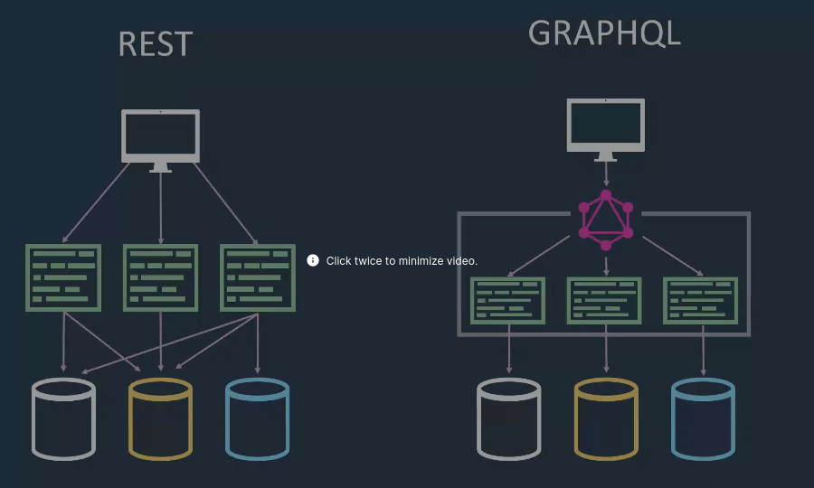

# KEYNOTE: MongoDB -- The Effective Developer - Work Smarter, Not Harder

- We must write code as **a team** not an individual.
- Code in a format which every one else understand
- Write more **simple** code becyase we must write code in a team
- Is your code simple enough? -  show it to your juniors developers ...ha ha funny no?
- Code review by junior developer.
- Seek to undersatns
- dont rant, give suggestion.
- Podcasts and audio books
- Meetups
- Book club
- How to find out **Known Unknowns**
- Try tools
    - Gitpod
    - GitHub Actions
- Invest time trying new thing
- Work on what matters
    - Thikn about the problem first
    - What possible other solution out there before jumping into new solutions
- User story
    - Always work on **Happy flow** than edge cases

### Effective developer

- Wriet code as team
- write simple code
- experiment
- hackathons
- what matters

> Efficiency is about getting more work done, effective is about getting more work right

# Microservices..

3 pillers of Observibality

## Metrics
> Metrics tells us the "what"

-  It tells somethign has broken but not when and why and whrere

- Promethus is a solution for handlign metrics in Kubernetes env
- Grafanca is used to visualise metrics, creating, dashboard etc
- grafana works with Promethus
- Alternative to Prometuhus, Cortex, Thanos, Victoria metrics, M3

## Logs
> Logs tells us the "why"

## Traces
> Logs tells us the "wherer"

Distributed tracing

- OpenCensus
- OpenTelemtry
- OpenTracing

- its a framework and not service.
- Capture before and after calls

## Kafka stream like a queue

# Monitoring Kubernetes vs. Serverless Based Applications

there is different betweeen containezation and serverless.. what?

- serverlss are API or code based vs container good old aget based
- cost: per request vs per resource
- monitor: application oly vs HW, O.S, K8s 

## Monitoring  of Kubernetese

The 5 layers of K8s

- Infa vital signs
- K8s clusters health
- pod heath
- readiness/ availabilty

### Monitoring 

Promethus :  tool to monitor Kubernetes.

Grafana :  For visualization

### Logs

kibana: 

Elasticsearch:

### Traffic

Vizceral: visualize the network traffic

### Service mesh

Istio

## Serverless

Serverless
- Lambda
- Fargate etc

- server are not available 
- they go down as the service ends
- I can not ssh into any of them to find problem
- that is challege when monitoring serverless and microservices
- no server you control

question is what and how will you monitor?

 
- Idea is to get metric, traces and logs unit thems into one platform

- lumigo

# JWTs- What developer need to know

FusionAtuh

- Drop in user data store
- Free as in beer
- Support
    - OAutn
    - SAML
    - Passwordless
    - And more 

- JWTs are RFC 7519
- statelss, portable store of idenitty
- signed and base 64 encocded
-

JWT
- header
    - Algo
- payload
    - Acutal user data
- signature
    - 

Token storage

- prefer server side
- httpOlny cookie on brwer

dan@fusionauth.io
@mooreds

Refresh token

- IDP gives jwt toke and refresh tokens to the client
- client then keep requesting the data from ther server using the JWT token.
- If the token expires ther servers can say expired.
- Client then requests the IDP for new JWT token using refresh token...
- The IDP regenerates the new JWT token
- Client uses this new token

Question:

I am still not able to understand what problem does refresh token solves? Like when the JWT expires, then the client can simply request a new JWT from IDP without using the refresh token, right? that is what anyway happening no? with refresh or without refresh token?

Answer

To generate JWT, the user has to use username and password. But with the refreh toke, during the same sessiong itself the jwt toke gets updates, that way user is not logged out duruing the session.

# Graph QL 

GraphQL

-  issue wiht rest api is having to several round to trips to get multipe data
- for exaple: you have orderlist api
- now you want: 

Apollo client

Making Queirs

Mutating DAta

How does GraphQL compare to an API Gateway?

single graphQL endpoint....does it mean we only need one endpoint per application ?

